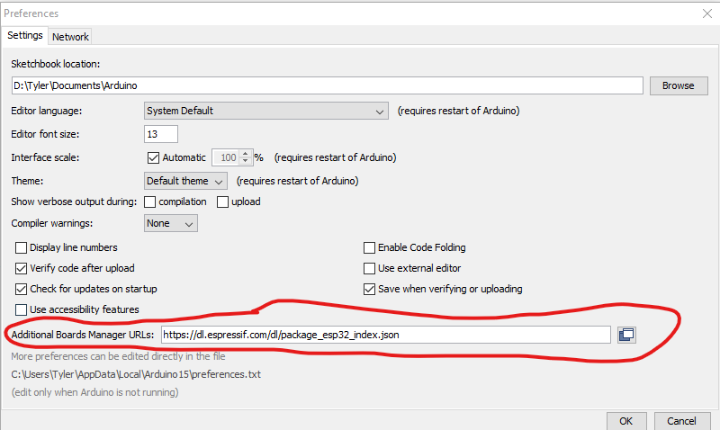
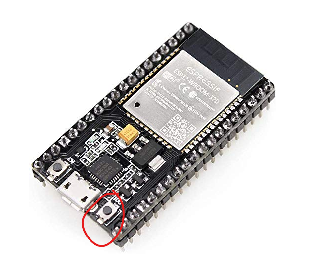
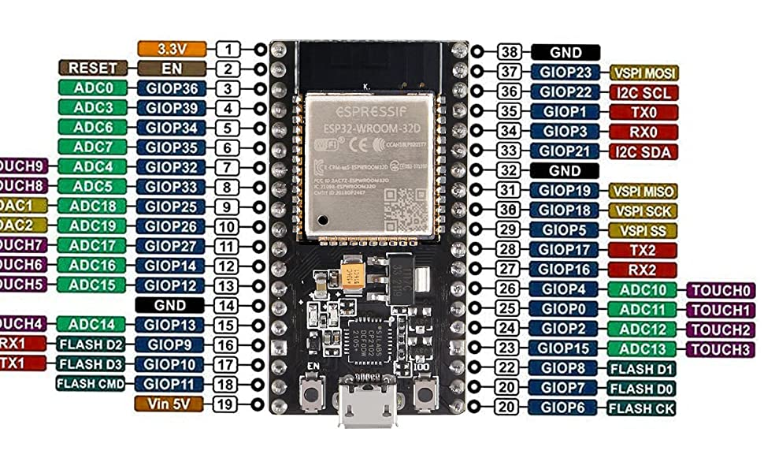

# ESP 32
This module acts as a bluetooth server and simply reads in commands from it's bluetooth connection and translates those commands into GPIO instructions to our light module.

Arduino IDE is needed to compile and transfer over to ESP32.

## Arduino IDE Setup
To program the ESP32, you will need to download the board packages for the ESP32. 
To do this, open up your Arduino IDE and go to "File -> Preferences".
In the settings tab, you will see a field named "Additional Boards Manager URLs", add this URL to the field: `https://dl.espressif.com/dl/package_esp32_index.json`. If you already have other URLs in that box, separate them by adding a comma between them.
Once you have added this URL, press "OK" in the dialog box to apply the changes.

Next, you download the board packages.
Go to "Tools -> Board -> Boards Manager". Type in "esp32" in the search bar. Press install on the result that comes up.

## Programming
To program your device with this software, select the "Node32s" board type in "Tools -> Board -> ESP32 Arduino -> Node32s".  
Select the correct COM/tty port in "Tools -> Port".  

While uploading the program, you will have to press and hold the "Boot Button" on the ESP32. This button is located to the right of the micro USB connector, as circled in red in the image below.

## Pinouts
By default, the following pinouts are used:
- Red LED, pin 23
- Yellow LED, pin 22
- Green LED, pin 21

This can be changed by modifying the `rPin`, `yPin`, and `gPin` variables located at the top of the `btControl.ino` file. 

The pinouts of the ESP32 microcontroller is shown below.

